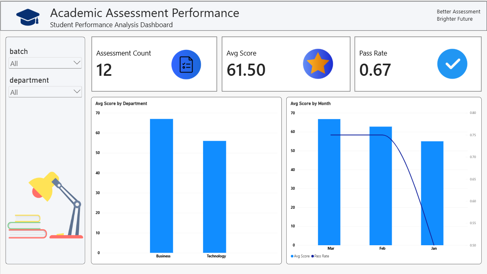
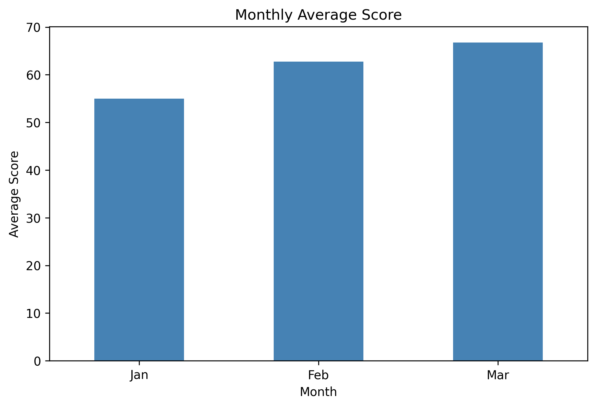

# 🎓 Academic Assessment Performance Analysis (Set C)

End-to-end analysis of student assessment data using **SQL, Excel, Python and Power BI**.

## 🎯 Objective
Find which departments, courses, batches and months perform best and worst, using one cleaned dataset analysed in four tools.

## 📝 Problem Statement
Assessment records (score and attendance per course, batch and month) and a course lookup table were given as raw CSV files. The raw data contained a duplicate record. The task was to clean it, check data integrity, define a pass rule (**score ≥ 50**), and report performance by department, course, batch and month.

## 📁 Repository Structure
```
data-analysis-set-c-9697/
├── data/raw/
│   ├── assessments.csv        # 13 rows (1 duplicate)
│   └── courses.csv            # 4 courses
├── sql/
│   ├── setup.sql              # schema + data load (12 unique rows)
│   └── queries.sql            # analysis + integrity queries
├── python/
│   └── analysis.ipynb         # cleaning, pass flag, summaries, chart
├── excel/
│   └── analysis.xlsx          # Raw, Lookup, Clean, Summary (pivot + chart)
├── powerbi/
│   └── dashboard.pbix         # interactive dashboard
├── outputs/
│   ├── clean_data.csv
│   ├── python_summary.csv
│   ├── python_chart.png
│   ├── powerbi_dashboard.png
│   └── sql/all_query_results.csv
├── requirements.txt
└── README.md
```

## 🧩 Task Breakdown

| Tool | Task | Result |
|---|---|---|
| SQL | Average score by department (S2a) | Technology 56.00, Business 67.00 |
| SQL | Courses with average score below 60 (S2b) | Python 49.33, PowerBI 53.33 |
| SQL | Top two batches by average score (S2c) | Evening 67.00, Morning 61.25 |
| SQL | Integrity check with `LEFT JOIN` (S3) | 0 unmatched courses, 0 orphan keys |
| Python | Remove duplicate, merge, null check | 13 → 12 rows, 0 nulls |
| Python | Pass flag and department pass rate | Business 83.33%, Technology 50.00% |
| Python | Course pass rate, lowest course | Python: 1 of 3 passed (33.33%) |
| Python | Monthly average score chart | Jan 55.00, Feb 62.75, Mar 66.75 |
| Excel | Clean sheet with `pass_flag` formula, pivot of average score by department and month | See `excel/analysis.xlsx` |
| Power BI | Dashboard with KPI cards, batch and department slicers, two charts | See below |

## 📊 Outputs

### Power BI Dashboard


### Python: Monthly Average Score


## 🛠️ Tools Used
- **SQL (MySQL)**: schema design, joins, aggregation, integrity checks
- **Excel**: formulas, pivot table, chart
- **Python**: pandas (cleaning, merge, groupby), matplotlib (chart)
- **Power BI**: KPI cards, slicers, charts

## ▶️ How to Run
**Python**
```bash
pip install -r requirements.txt
cd python
jupyter notebook analysis.ipynb
```
Run all cells. Outputs are saved to `outputs/`.

**SQL**: run `sql/setup.sql`, then `sql/queries.sql` in MySQL.

**Excel / Power BI**: open `excel/analysis.xlsx` and `powerbi/dashboard.pbix`.

## ✅ Outcome
- Dataset cleaned: 1 duplicate removed, 12 unique records, no missing values, all keys matched.
- Overall: **average score 61.50**, **pass rate 66.7%** (8 of 12 assessments passed).
- **Business** (avg 67.00) outperforms **Technology** (avg 56.00).
- **Python** is the weakest course (avg 49.33, 33.33% pass rate), followed by **PowerBI** (avg 53.33).
- **Evening** is the best batch (avg 67.00).
- Average score improves each month: Jan 55.00 → Feb 62.75 → Mar 66.75.
